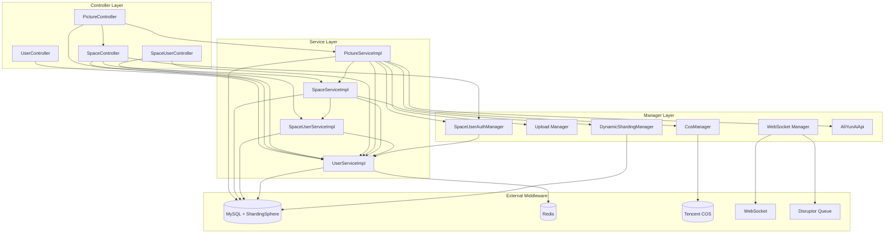
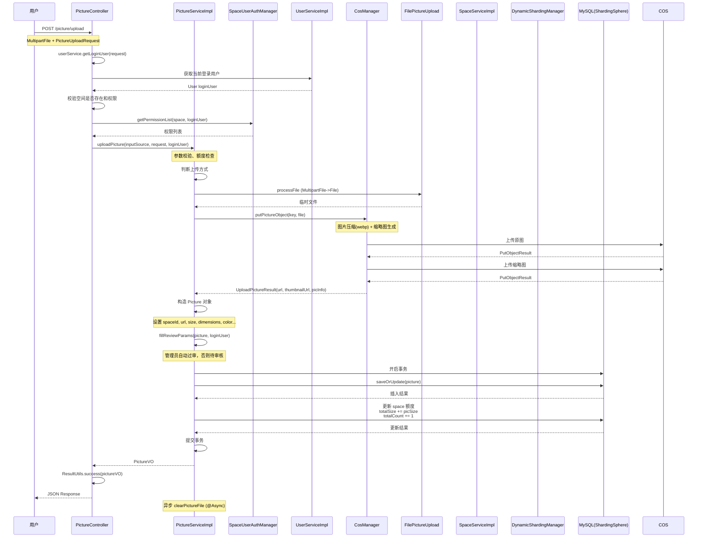

# Project Architecture Analysis

## Core Business Modules

| Module | Package Path | Responsibility |
|--------|--------------|----------------|
| **User Management** | `com.yupi.yupicturebackend.service.UserService` | User registration, login, logout, VIP exchange, permission validation |
| **Picture Management** | `com.yupi.yupicturebackend.service.PictureService` | Picture upload/download/delete/edit, AI expansion, color search |
| **Space Management** | `com.yupi.yupicturebackend.service.SpaceService` | Space creation/editing/deletion, space level configuration, permission validation |
| **Space Members** | `com.yupi.yupicturebackend.service.SpaceUserService` | Team space member management, role assignment, permission control |
| **File Storage** | `com.yupi.yupicturebackend.manager.CosManager` | Tencent COS operations, image compression/thumbnail generation |
| **File Upload** | `com.yupi.yupicturebackend.manager.upload` | File upload (MultipartFile), URL upload abstraction |
| **Permission Auth** | `com.yupi.yupicturebackend.manager.auth` | Sa-Token authentication, space permission management, custom annotation |
| **Real-time Collaboration** | `com.yupi.yupicturebackend.manager.websocket` | WebSocket real-time editing, Disruptor event handling |
| **Data Sharding** | `com.yupi.yupicturebackend.manager.sharding` | ShardingSphere dynamic table, space picture isolation |
| **Analytics** | `com.yupi.yupicturebackend.service.SpaceAnalyzeService` | Space usage, category, tag, size, user behavior analysis |
| **AI Service** | `com.yupi.yupicturebackend.api.aliyunai` | Aliyun AI expansion service |
| **Image Search** | `com.yupi.yupicturebackend.api.imagesearch` | Search by image, color search |

## Module Dependency Analysis

### Internal Dependencies
- **UserController** → `UserService` - User lifecycle management
- **PictureController** → `PictureService`, `SpaceService`, `UserService` - Picture operations + permission validation
- **SpaceController** → `SpaceService`, `UserService` - Space management
- **SpaceUserController** → `SpaceUserService`, `UserService` - Team member management
- **PictureService** → `CosManager`, `FileUpload`, `AliYunAiApi` - Core business hub
- **SpaceService** → `UserService`, `SpaceUserService` - Space-member association
- **SpaceUserAuthManager** - Core permission provider, called by multiple Controllers

### External Middleware Dependencies
- **MySQL**: Main database with MyBatis-Plus
- **ShardingSphere JDBC**: Database/table sharding
- **Redis**: Session storage, caching (with Caffeine 2nd-level cache)
- **Tencent COS**: Object storage for images
- **WebSocket**: Spring WebSocket for real-time editing
- **Disruptor**: High-performance lock-free queue for async events
- **Caffeine**: Local caching to reduce Redis access
- **Sa-Token**: Authentication framework (DEFAULT and SPACE auth systems)

## Mermaid Diagrams

### High-Level Module Dependency Graph

### Core Data Flow Sequence Diagram (User Picture Upload)

## Key Target Classes for Deep Dive

### 1. `com.yupi.yupicturebackend.service.impl.PictureServiceImpl`

**Why**:
- Core implementation class for picture management with most complex business logic
- Multiple upload methods (file/URL) unified handling
- AI expansion, color search, batch editing features
- Integrates CosManager for file storage, AliYunAiApi for AI processing
- Uses Disruptor for async processing, transaction management, space quota control
- Complete permission validation and data validation logic

### 2. `com.yupi.yupicturebackend.manager.websocket.PictureEditHandler`

**Why**:
- Real-time collaboration editing core handler
- WebSocket lifecycle management (connect, message, disconnect)
- Disruptor high-performance event queue integration
- Concurrency control for multiple users editing same image
- `ConcurrentHashMap` for managing image editing sessions
- Message broadcasting and precise session delivery

### 3. `com.yupi.yupicturebackend.manager.auth.SpaceUserAuthManager`

**Why**:
- Space permission authentication core component
- RBAC permission model implementation
- Private space and team space different permission strategies
- Dynamic JSON-based permission rules loading
- Base support for Sa-Token annotation-based authorization

### 4. `com.yupi.yupicturebackend.manager.sharding.DynamicShardingManager`

**Why**:
- Advanced database architecture (database/table sharding)
- Dynamic table creation/removal at runtime (not static config)
- ShardingSphere ContextManager API operations
- Space creation time dynamic table creation
- Business rules (only for premium team spaces)
- Shows how to modify shard configuration at runtime

---

**Note**: This is an architecture analysis document. No implementation plan is provided - this document is for understanding the codebase structure.
