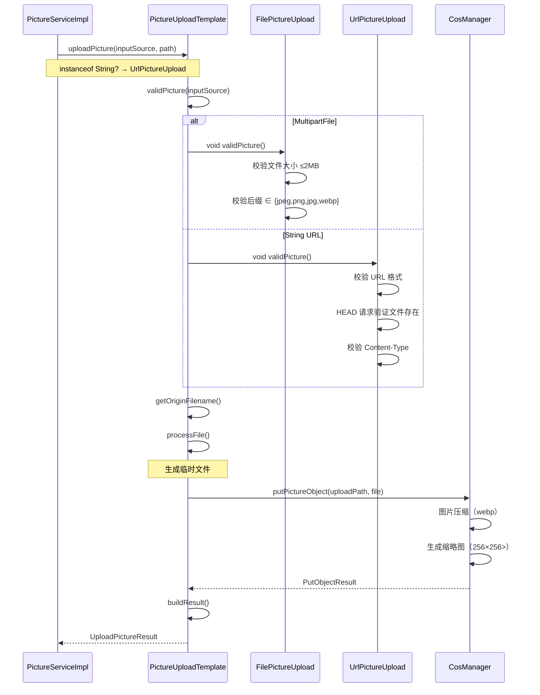

# PictureServiceImpl 代码审查解析卡

## 📋 基本信息

| 项目 | 内容 |
|------|------|
| **类路径** | `com.yupi.yupicturebackend.service.impl.PictureServiceImpl` |
| **代码行数** | 660 行 |
| **核心职责** | 图片管理核心业务逻辑 |
| **技术栈** | Spring Boot 2.7.6 + MyBatis-Plus + ShardingSphere + Tencent COS |

---

## 🔄 核心方法执行流程

### 1. `uploadPicture()` - 图片上传流程

```
用户请求
    ↓
[1] 参数校验（登录用户、空间存在性）
    ↓
[2] 额度检查（空间条数/大小限制）
    ↓
[3] 判断新增/更新（pictureId 决定）
    ↓
[4] 构建上传路径（public/{userId} 或 space/{spaceId}）
    ↓
[5] 策略选择（FilePictureUpload / UrlPictureUpload）
    ↓
[6] 模板方法上传 → COS → 返回上传结果
    ↓
[7] 构造 Picture 实体（颜色转换、尺寸信息）
    ↓
[8] 补充审核参数（管理员自动过审）
    ↓
[9] 事务执行：
    ├─ saveOrUpdate(picture)
    └─ updateSpaceQuota (totalSize + totalCount)
    ↓
[10] 异步清理旧文件（@Async clearPictureFile）
    ↓
返回 PictureVO
```

**关键设计点**：
- 支持**公共图库**（spaceId = null）和**私有空间**两种模式
- 更新图片时**空间 ID 一致性校验**
- 使用 `TransactionTemplate` 手动管理事务边界

---

### 2. `PictureUploadTemplate` 模板方法模式



**模板方法模式优势**：
- 封装**不变部分**（上传流程、临时文件处理、COS 调用）
- 延迟**可变部分**（文件校验、文件获取、文件处理）到子类
- 单一职责：`FilePictureUpload` 和 `UrlPictureUpload` 各司其职

---

## 🎯 高级 Java 特性使用

### 1. 策略模式 + 模板方法模式

```java
// 抽象模板
public abstract class PictureUploadTemplate {
    public final UploadPictureResult uploadPicture(Object inputSource, String path) {
        validPicture(inputSource);      // 钩子方法
        processFile(inputSource, file); // 钩子方法
        // ... 模板流程
    }
    protected abstract void validPicture(Object inputSource);
}

// 具体策略
public class FilePictureUpload extends PictureUploadTemplate {
    @Override
    protected void validPicture(Object inputSource) {
        MultipartFile multipartFile = (MultipartFile) inputSource;
        // 文件校验逻辑
    }
}
```

**使用场景**：支持多种上传方式（MultipartFile / URL），未来可轻松扩展新策略

---

### 2. 事务管理：TransactionTemplate

```java
transactionTemplate.execute(status -> {
    // 插入数据
    boolean result = this.saveOrUpdate(picture);
    ThrowUtils.throwIf(!result, ErrorCode.OPERATION_ERROR, "图片上传失败");

    if (finalSpaceId != null) {
        // 更新空间额度（使用 SQL 拼接避免并发覆盖）
        boolean update = spaceService.lambdaUpdate()
            .eq(Space::getId, finalSpaceId)
            .setSql("totalSize = totalSize + " + picture.getPicSize())
            .setSql("totalCount = totalCount + 1")
            .update();
    }
    return picture;
});
```

**设计亮点**：
- **手动事务控制**：比 `@Transactional` 更灵活，可精确控制事务边界
- **SQL 级别并发控制**：`totalSize + picture.getPicSize()` 避免读-修改-写冲突

---

### 3. 异步处理：@Async

```java
@Async
@Override
public void clearPictureFile(Picture oldPicture) {
    // 检查是否被多条记录使用
    long count = this.lambdaQuery()
        .eq(Picture::getUrl, pictureUrl)
        .count();

    if (count > 1) return; // 多处引用，不清理

    // 删除 COS 对象
    cosManager.deleteObject(pictureUrl);
    cosManager.deleteObject(thumbnailUrl);
}
```

**使用要点**：
- 需在主类上添加 `@EnableAsync`（未在代码中显示，但配置中应存在）
- **单向异步**：不关心执行结果，只执行清理
- **安全检查**：先查询再删除，避免误删共享图片

---

### 4. Stream API + Lambda 表达式

```java
// 分组聚合
Map<Long, List<User>> userIdUserListMap = userService.listByIds(userIdSet)
    .stream()
    .collect(Collectors.groupingBy(User::getId));

// 排序 + 限制
List<Picture> sortedPictureList = pictureList.stream()
    .sorted(Comparator.comparingDouble(picture -> {
        Color pictureColor = Color.decode(hexColor);
        return -ColorSimilarUtils.calculateSimilarity(targetColor, pictureColor);
    }))
    .limit(12)
    .collect(Collectors.toList());
```

---

### 5. Optional 处理空值

```java
// 优雅的空值处理
Picture picture = Optional.ofNullable(this.getById(pictureId))
    .orElseThrow(() -> new BusinessException(ErrorCode.NOT_FOUND_ERROR, "图片不存在"));
```

---

## 🔐 异常边界处理精妙之处

### 1. 幂等性设计

```java
// 场景：用户重复提交上传请求
if (pictureId != null) {
    // 更新模式
    picture.setId(pictureId);
    picture.setEditTime(new Date());
    this.updateById(picture); // MySQL 主键更新天然幂等
} else {
    // 新增模式
    this.save(picture); // 插入新记录
}
```

**幂等保障**：
- **更新操作**：MySQL 主键更新是原子操作，重复执行结果一致
- **新增操作**：每次生成新的 UUID 文件名，不会覆盖

---

### 2. 并发冲突处理（空间额度）

```java
// ❌ 错误写法（存在竞态条件）
Space space = spaceService.getById(spaceId);
space.setTotalSize(space.getTotalSize() + picture.getPicSize());
spaceService.updateById(space); // 读-修改-写间隔内可能被其他请求覆盖

// ✅ 正确写法（原子更新）
spaceService.lambdaUpdate()
    .eq(Space::getId, finalSpaceId)
    .setSql("totalSize = totalSize + " + picture.getPicSize())
    .setSql("totalCount = totalCount + 1")
    .update();
```

**原子更新原理**：
- SQL 执行：`UPDATE space SET totalSize = totalSize + 100 WHERE id = ?`
- 数据库层面原子操作，无需应用层加锁

---

### 3. 数据一致性保障

```java
// 事务内操作
transactionTemplate.execute(status -> {
    // 1. 图片入库
    this.saveOrUpdate(picture);

    // 2. 额度更新（空间使用量）
    spaceService.lambdaUpdate()
        .eq(Space::getId, finalSpaceId)
        .setSql("totalSize = totalSize + " + picture.getPicSize())
        .setSql("totalCount = totalCount + 1")
        .update();

    return picture;
});

// 异步操作（不阻塞主流程）
this.clearPictureFile(oldPicture);
```

**一致性策略**：
- **强一致性**：事务内操作保证数据库级别一致性
- **最终一致性**：异步清理文件，不影响主流程

---

### 4. 权限校验双重保护

```java
// Controller 层：基于注解的权限校验
@SaSpaceCheckPermission(permission = SpaceUserPermissionConstant.PICTURE_UPLOAD)
public Result upload(@RequestBody PictureUploadRequest request) { }

// Service 层：基于上下文的权限校验
public PictureVO uploadPicture(..., User loginUser) {
    // 校验空间权限
    SpaceUserAuthContext context = spaceUserAuthManager.getPermissionList(space, loginUser);
    // ... 进一步业务校验
}
```

**分层防护**：
- **注解层**：方法级权限控制，快速拒绝
- **业务层**：细粒度业务权限校验

---

### 5. 防止覆盖上传

```java
// 上传路径使用 UUID + 时间戳
String uuid = RandomUtil.randomString(16);
String uploadFilename = String.format("%s_%s.%s",
    DateUtil.formatDate(new Date()),
    uuid,
    FileUtil.getSuffix(originalFilename));
```

**UUID 生成示例**：`20241215_abcdefghij123456.png`

**防冲突原理**：
- 即使同一用户上传同名文件，也会生成不同的存储路径
- 临时文件名也使用 UUID，避免并发上传冲突

---

### 6. 文件清理安全检查

```java
// 检查图片是否被多条记录使用
long count = this.lambdaQuery()
    .eq(Picture::getUrl, pictureUrl)
    .count();

if (count > 1) return; // 多处引用，不清理
```

**场景举例**：
- 用户上传图片 A → 某个空间使用
- 用户复制图片 A → 另一个空间引用同一 URL
- 删除第一个空间的图片 → **不应删除 COS 中的文件**（第二个空间还在用）

---

## 📊 批量操作优化

### `uploadPictureByBatch()` - 批量抓取上传

```java
// 1. Jsoup 抓取网页
Document document = Jsoup.connect(fetchUrl).get();

// 2. 解析元素
Elements imgElementList = div.select("img.mimg");

// 3. 循环上传
for (Element imgElement : imgElementList) {
    try {
        PictureVO pictureVO = this.uploadPicture(fileUrl, request, loginUser);
        uploadCount++;
    } catch (Exception e) {
        log.error("图片上传失败", e);
        continue; // 单个失败不影响其他
    }
    if (uploadCount >= count) break;
}
```

**优化点**：
- **快失败**：`count > 30` 直接抛异常
- **容错设计**：单个失败不影响整体
- **及时退出**：达到数量立即 break

---

### `editPictureByBatch()` - 批量编辑

```java
// 1. 只查询需要的字段（减少网络开销）
List<Picture> pictureList = this.lambdaQuery()
    .select(Picture::getId, Picture::getSpaceId) // ✅ 只查必要字段
    .eq(Picture::getSpaceId, spaceId)
    .in(Picture::getId, pictureIdList)
    .list();

// 2. 内存中修改
pictureList.forEach(picture -> {
    picture.setCategory(category);
    picture.setTags(JSONUtil.toJsonStr(tags));
});

// 3. 批量更新（减少数据库Round-Trip）
this.updateBatchById(pictureList);
```

**优化点**：
- **字段投影**：`.select()` 避免查询不需要的字段
- **批量更新**：`updateBatchById()` 一次 SQL 更新多条记录

---

## 🔍 代码质量亮点

### 1. 统一异常抛出模式

```java
// ThrowUtils 工具类
public static void throwIf(boolean condition, ErrorCode errorCode, String message) {
    throwIf(condition, new BusinessException(errorCode, message));
}

// 使用示例
ThrowUtils.throwIf(loginUser == null, ErrorCode.NO_AUTH_ERROR);
ThrowUtils.throwIf(space == null, ErrorCode.NOT_FOUND_ERROR, "空间不存在");
ThrowUtils.throwIf(fileSize > 2 * ONE_M, ErrorCode.PARAMS_ERROR, "文件大小不能超过 2MB");
```

**优势**：
- 统一异常入口，便于日志记录和监控
- 代码简洁，`throwIf(condition, ...)` 一行解决

---

### 2. Hutool 工具类极致利用

```java
// 字符串校验
StrUtil.isNotBlank(url)
ObjUtil.isNotEmpty(id)
ObjUtil.isNull(id)
ObjUtil.notEqual(spaceId, oldPicture.getSpaceId())

// 集合操作
CollUtil.isEmpty(list)
CollUtil.isNotEmpty(list)

// Bean 操作
BeanUtil.copyProperties(source, target)
BeanUtil.copyProperties(pictureReviewRequest, updatePicture)
```

**优势**：
- 减少空指针异常风险
- 代码可读性强

---

### 3. 常量定义规范

```java
final long ONE_M = 1024 * 1024;
ThrowUtils.throwIf(fileSize > 2 * ONE_M, ...);

final List<String> ALLOW_FORMAT_LIST = Arrays.asList("jpeg", "png", "jpg", "webp");
ThrowUtils.throwIf(!ALLOW_FORMAT_LIST.contains(fileSuffix), ...);
```

**优势**：
- 魔法数字 → 常量命名
- 列表配置化，易于修改

---

## ⚠️ 潜在优化建议

| 问题 | 建议 | 优先级 |
|------|------|--------|
| 部分 `if` 分支嵌套较深（>4 层） | 提取方法，减少嵌套 | MEDIUM |
| `AsStringAsync` 方法无返回值，无法监控失败 | 考虑返回 `CompletableFuture` | LOW |
| `uploadPictureByBatch()` 无事务保护 | 批量上传部分成功后无法回滚 | MEDIUM |
| 部分方法过长（>50 行） | 如 `uploadPicture()` 可拆分 | LOW |
| 缺少单元测试 | 核心业务逻辑未见对应 Test 类 | HIGH |

---

## 📈 性能优化点

| 优化项 | 实现方式 |
|--------|----------|
| **数据库查询** | `lambdaQuery().select()` 字段投影 |
| **批量操作** | `updateBatchById()` 减少 Round-Trip |
| **文件存储** | COS 自动压缩（webp）+ 缩略图 |
| **并发控制** | SQL 原子更新 `totalSize = totalSize + ?` |
| **异步处理** | `@Async` 清理文件不阻塞主流程 |
| **缓存优化** | Redis + Caffeine 多级缓存（未在本类体现） |

---

## 🎓 核心知识点总结

### 设计模式
1. **模板方法模式**：`PictureUploadTemplate`
2. **策略模式**：`FilePictureUpload` / `UrlPictureUpload`
3. ** RBAC 权限模型**：`SpaceUserAuthManager`

### Spring Boot 技术
1. **TransactionTemplate**：手动事务控制
2. **@Async**：异步处理
3. **@Resource**：依赖注入
4. **@Service**：服务层标注

### Java 基础
1. **Stream API**：函数式编程
2. **Optional**：空值处理
3. **Lambda 表达式**：简化代码
4. **继承与多态**：模板方法模式实现

### 数据库
1. **原子更新**：`SET column = column + ?`
2. **事务 ACID**：`.execute(status -> {...})`
3. **软删除**：`isDelete` 字段

### 并发安全
1. **幂等性设计**：UUID 文件名 + 主键更新
2. **并发冲突**：SQL 级别原子操作
3. **数据一致性**：事务 + 异步最终一致

---

**生成时间**：2026-03-03
**分析工具**：Claude Code / Spring Boot Patterns / Java Coding Standards / Backend Patterns
